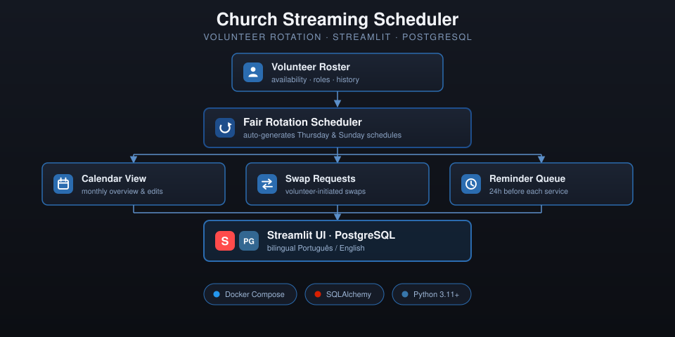

# 📺 Escala do Ministério de Transmissão

Sistema bilíngue (**Português / English**) para gerenciamento de escalas do ministério de transmissão de igrejas, desenvolvido com **Streamlit** e **PostgreSQL**, focado em automação, rotatividade justa de voluntários e redução de esforço manual.

O projeto foi pensado para começar como um **MVP local** e evoluir naturalmente para um **ambiente em produção em VPS**.



## ✨ Funcionalidades
### MVP (atual)
- 👥 Cadastro e gestão de voluntários
- 📅 Geração automática de escalas (Quintas e Domingos)
- 🔄 Rotatividade justa entre voluntários e funções
- 🗓️ Visualização mensal em formato de calendário
- ✏️ Edição manual da escala
- 🔁 Solicitação de trocas
- ⏰ Lembretes automáticos (24h antes)
- 🌎 Interface bilíngue
- 🐘 PostgreSQL (Docker)

## 🚀 Execução rápida
```bash
docker compose up -d
pip install -r requirements.txt
streamlit run app.py
```

## 🙏 Propósito
Servir a igreja, reduzir fricção operacional e substituir planilhas por um sistema confiável.
